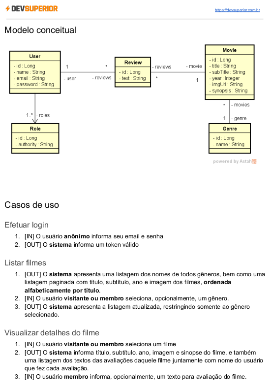

# Desafio$#05 - Consultas ao banco de dados

O sistema MovieFlix consiste em um banco de filmes, os quais podem ser listados e avaliados
pelos usuários. Usuários podem ser visitantes (VISITOR) e membros (MEMBER). Apenas
usuários membros podem inserir avaliações no sistema.

## **Técnologias empregadas**

- Spring Boot
- Spring Data
- Spring Web
- H2 Database
- Spring Validation
- Spring Security